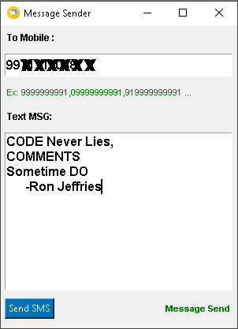

# messageSender-GUI
A python script to send bulk text message through SMS Gateway API.

You can access it using your Terminal

__________________________________________________________________________
**Usage**

1. Open your Terminal/cmd

2. git clone this project to your preferred directory.

3. `cd messageSender-GUI`

4. `python messageSender.py`  

<br/>

or Execute:

```
ExecuteMessageSender.cmd
```




__________________________________________________________________________
**License**

This project is licensed under the terms of the [MIT license](https://github.com/yogesh7132/messageSender/blob/master/LICENSE).
